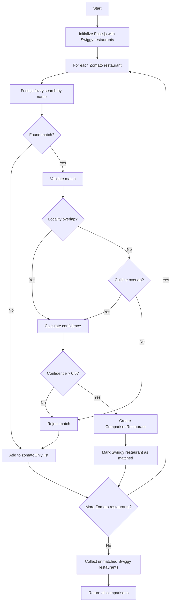

# Restaurant Matching Algorithm

## Overview

The matching algorithm identifies the same restaurant across Swiggy and Zomato platforms. Since restaurants may have different names, IDs, and data formats on each platform, we use fuzzy matching with multiple validation criteria.

## Algorithm Flow



## Fuse.js Configuration

```typescript
const RESTAURANT_FUSE_OPTIONS: Fuse.IFuseOptions<NormalizedRestaurant> = {
  keys: [
    { name: 'name', weight: 0.7 },      // Name is most important
    { name: 'locality', weight: 0.2 },   // Location helps disambiguate
    { name: 'cuisines', weight: 0.1 }    // Cuisines as secondary signal
  ],
  threshold: 0.4,           // 0 = exact, 1 = match anything
  includeScore: true,       // Need score for confidence calculation
  ignoreLocation: true,     // Search entire string
  minMatchCharLength: 2,    // Minimum characters to consider
};
```

### Threshold Explanation
- `0.0`: Exact match only
- `0.2`: Very strict (catches typos)
- `0.4`: **Current setting** - balanced
- `0.6`: Permissive (more false positives)
- `1.0`: Matches everything

## Matching Logic

### Step 1: Fuzzy Name Match

```typescript
const fuse = new Fuse(swiggyRestaurants, RESTAURANT_FUSE_OPTIONS);

for (const zomatoRestaurant of zomatoRestaurants) {
  const results = fuse.search(zomatoRestaurant.name);

  if (results.length === 0 || results[0].score! > 0.4) {
    // No good match found
    unmatched.push(zomatoRestaurant);
    continue;
  }

  const bestMatch = results[0];
  const swiggyRestaurant = bestMatch.item;
  // Continue to validation...
}
```

### Step 2: Locality Validation

Restaurants in different localities are likely different, even with similar names.

```typescript
function hasLocalityOverlap(
  swiggyLocality: string,
  zomatoLocality: string
): boolean {
  const normalize = (s: string) =>
    s.toLowerCase()
     .replace(/[^a-z0-9]/g, '')
     .trim();

  const swiggy = normalize(swiggyLocality);
  const zomato = normalize(zomatoLocality);

  // Direct match
  if (swiggy === zomato) return true;

  // Substring match (e.g., "Koramangala" contains "Koramangala 5th Block")
  if (swiggy.includes(zomato) || zomato.includes(swiggy)) return true;

  // Word overlap (e.g., "HSR Layout" vs "HSR Sector 2")
  const swiggyWords = swiggy.split(/\s+/);
  const zomatoWords = zomato.split(/\s+/);
  const overlap = swiggyWords.filter(w => zomatoWords.includes(w));

  return overlap.length > 0;
}
```

### Step 3: Cuisine Validation

Restaurants with no cuisine overlap are likely different.

```typescript
function hasCuisineOverlap(
  swiggyCuisines: string[],
  zomatoCuisines: string[]
): boolean {
  const normalize = (s: string) => s.toLowerCase().trim();

  const swiggySet = new Set(swiggyCuisines.map(normalize));
  const zomatoSet = new Set(zomatoCuisines.map(normalize));

  for (const cuisine of swiggySet) {
    if (zomatoSet.has(cuisine)) return true;

    // Check for related cuisines
    for (const zCuisine of zomatoSet) {
      if (areCuisinesRelated(cuisine, zCuisine)) return true;
    }
  }

  return false;
}

function areCuisinesRelated(a: string, b: string): boolean {
  const relatedGroups = [
    ['indian', 'north indian', 'south indian', 'mughlai'],
    ['chinese', 'pan asian', 'asian'],
    ['italian', 'pizza', 'pasta'],
    ['american', 'burger', 'fast food'],
    ['biryani', 'hyderabadi', 'mughlai'],
  ];

  for (const group of relatedGroups) {
    if (group.includes(a) && group.includes(b)) return true;
  }

  return false;
}
```

### Step 4: Confidence Calculation

```typescript
function calculateMatchConfidence(
  fuseScore: number,          // 0 (exact) to 1 (no match)
  hasLocality: boolean,
  hasCuisine: boolean
): number {
  // Base confidence from Fuse.js (invert score: lower is better)
  let confidence = (1 - fuseScore) * 0.7;

  // Locality bonus
  if (hasLocality) {
    confidence += 0.2;
  }

  // Cuisine bonus
  if (hasCuisine) {
    confidence += 0.1;
  }

  return Math.min(confidence, 1.0);
}
```

**Example Calculations**:

| Scenario | Fuse Score | Locality | Cuisine | Confidence |
|----------|------------|----------|---------|------------|
| Exact name, same locality, same cuisine | 0.0 | Yes | Yes | 1.0 |
| Slight typo, same locality | 0.1 | Yes | Yes | 0.93 |
| Similar name, different locality, same cuisine | 0.2 | No | Yes | 0.66 |
| Similar name, no locality, no cuisine | 0.3 | No | No | 0.49 (rejected) |

## Creating Comparison Results

```typescript
interface ComparisonRestaurant {
  id: string;                          // Unique ID for this comparison
  name: string;                        // Best name (from higher-rated platform)
  swiggy?: NormalizedRestaurant;       // Swiggy data (if matched/only)
  zomato?: NormalizedRestaurant;       // Zomato data (if matched/only)
  matchConfidence?: number;            // 0-1 if matched
  cuisines: string[];                  // Merged cuisines
  bestRating: number;                  // Highest rating
  bestDeliveryTime: number;            // Fastest delivery
  lowestCostForTwo: number;            // Cheapest option
}

function createComparison(
  swiggy: NormalizedRestaurant | null,
  zomato: NormalizedRestaurant | null,
  confidence?: number
): ComparisonRestaurant {
  const primary = swiggy || zomato!;

  // Merge cuisines (deduplicated)
  const cuisines = [...new Set([
    ...(swiggy?.cuisines || []),
    ...(zomato?.cuisines || [])
  ])];

  return {
    id: generateComparisonId(swiggy, zomato),
    name: primary.name,
    swiggy: swiggy || undefined,
    zomato: zomato || undefined,
    matchConfidence: confidence,
    cuisines,
    bestRating: Math.max(swiggy?.rating || 0, zomato?.rating || 0),
    bestDeliveryTime: Math.min(
      swiggy?.deliveryTime || Infinity,
      zomato?.deliveryTime || Infinity
    ),
    lowestCostForTwo: Math.min(
      swiggy?.costForTwo || Infinity,
      zomato?.costForTwo || Infinity
    ),
  };
}

function generateComparisonId(
  swiggy: NormalizedRestaurant | null,
  zomato: NormalizedRestaurant | null
): string {
  if (swiggy && zomato) {
    return `matched-${swiggy.platformId}-${zomato.platformId}`;
  }
  if (swiggy) {
    return `swiggy-only-${swiggy.platformId}`;
  }
  return `zomato-only-${zomato!.platformId}`;
}
```

## Menu Item Matching

Menu items use a similar but stricter approach:

```typescript
const MENU_FUSE_OPTIONS: Fuse.IFuseOptions<NormalizedMenuItem> = {
  keys: [
    { name: 'name', weight: 0.9 },     // Name is critical for menu items
    { name: 'category', weight: 0.1 }   // Category as tiebreaker
  ],
  threshold: 0.3,                       // Stricter than restaurants
  includeScore: true,
};

function matchMenuItems(
  swiggyMenu: NormalizedMenuItem[],
  zomatoMenu: NormalizedMenuItem[]
): ComparisonMenuItem[] {
  // Group by category first
  const swiggyByCategory = groupByCategory(swiggyMenu);
  const zomatoByCategory = groupByCategory(zomatoMenu);

  const comparisons: ComparisonMenuItem[] = [];

  for (const [category, swiggyItems] of Object.entries(swiggyByCategory)) {
    const zomatoItems = zomatoByCategory[category] || [];
    const fuse = new Fuse(swiggyItems, MENU_FUSE_OPTIONS);

    for (const zomatoItem of zomatoItems) {
      const results = fuse.search(zomatoItem.name);

      if (results.length > 0 && results[0].score! < 0.3) {
        const swiggyItem = results[0].item;

        // Additional validation: veg/non-veg must match
        if (swiggyItem.isVeg === zomatoItem.isVeg) {
          comparisons.push(createMenuComparison(swiggyItem, zomatoItem, category));
          continue;
        }
      }

      // No match - add as Zomato only
      comparisons.push(createMenuComparison(null, zomatoItem, category));
    }
  }

  return comparisons;
}
```

## Performance Considerations

1. **Fuse.js Initialization**: Create index once, reuse for multiple searches
2. **Early Exit**: Reject obvious non-matches before expensive checks
3. **Caching**: Cache match results for repeated requests

## Edge Cases

### Chain Restaurants
Multiple branches of the same chain (e.g., "McDonald's Koramangala" vs "McDonald's HSR"):
- Locality check prevents false matches
- Each branch matched independently

### Similar Names
"Pizza Hut" vs "Pizza House":
- Fuse.js may consider them similar
- Cuisine overlap helps validate
- Locality check is critical

### Transliteration
"Biryani House" vs "Biriyani House" vs "Briyani House":
- Fuse.js handles common misspellings
- Threshold of 0.4 catches most variants

## Debugging

```typescript
// Add to match function for debugging
console.log('Match analysis:', {
  swiggy: swiggyRestaurant.name,
  zomato: zomatoRestaurant.name,
  fuseScore: bestMatch.score,
  localityOverlap: hasLocalityOverlap(/*...*/),
  cuisineOverlap: hasCuisineOverlap(/*...*/),
  finalConfidence: confidence,
  matched: confidence > 0.5,
});
```
