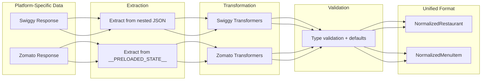
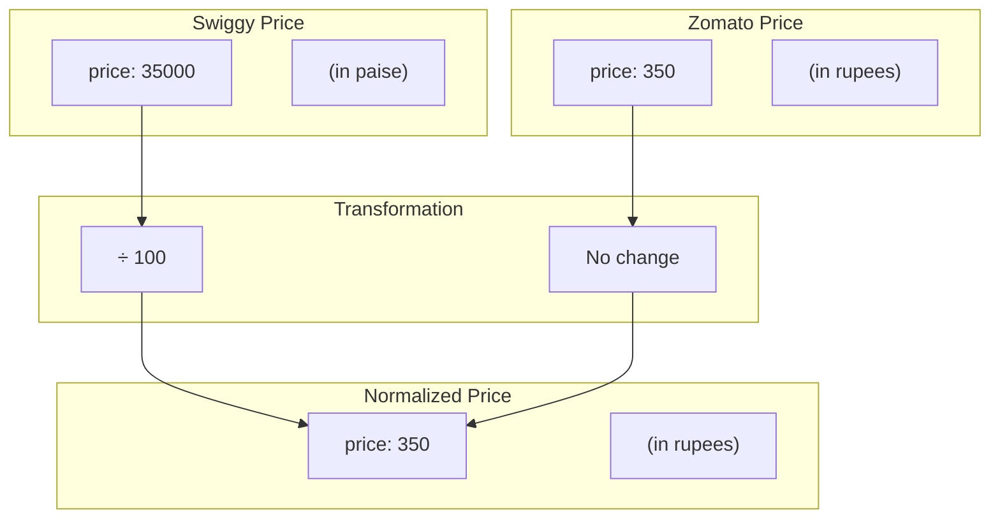

# Data Normalization

## Overview

Normalization transforms platform-specific data formats (Swiggy, Zomato) into a unified format that enables comparison and matching. This document details the normalization process and data transformations.

## Normalization Pipeline



## Unified Data Types

### NormalizedRestaurant

```typescript
interface NormalizedRestaurant {
  // Identity
  platform: 'swiggy' | 'zomato';
  platformId: string;

  // Basic Info
  name: string;
  locality: string;
  cuisines: string[];

  // Ratings
  rating: number;           // 0-5 scale
  ratingCount: number;      // Number of ratings

  // Pricing & Delivery
  costForTwo: number;       // In rupees
  deliveryTime: number;     // In minutes

  // Media
  image: string | null;

  // Status
  isOpen: boolean;

  // Actions
  deepLink: string;         // Direct order URL
}
```

### NormalizedMenuItem

```typescript
interface NormalizedMenuItem {
  // Identity
  platform: 'swiggy' | 'zomato';
  platformId: string;

  // Basic Info
  name: string;
  description: string;
  category: string;

  // Classification
  isVeg: boolean;

  // Pricing
  price: number;            // In rupees

  // Media
  image: string | null;

  // Status
  inStock: boolean;

  // Optional
  rating?: number;
}
```

## Swiggy Normalization

### Restaurant Normalization

```typescript
function normalizeSwiggyRestaurant(
  info: SwiggyRestaurantInfo
): NormalizedRestaurant {
  return {
    // Identity
    platform: 'swiggy',
    platformId: String(info.id),

    // Basic Info
    name: normalizeRestaurantName(info.name),
    locality: info.locality || info.areaName || '',
    cuisines: (info.cuisines || []).map(normalizeCuisineName),

    // Ratings
    rating: info.avgRating || 0,
    ratingCount: parseRatingCount(info.totalRatingsString),

    // Pricing & Delivery
    costForTwo: parseCostForTwo(info.costForTwo),
    deliveryTime: info.sla?.deliveryTime || 0,

    // Media
    image: buildSwiggyImageUrl(info.cloudinaryImageId),

    // Status
    isOpen: info.isOpen !== false,

    // Actions
    deepLink: buildSwiggyDeepLink(info),
  };
}
```

### Transformation Functions

```typescript
// Name normalization
function normalizeRestaurantName(name: string): string {
  return name
    .trim()
    .replace(/\s+/g, ' ')           // Collapse multiple spaces
    .replace(/[^\w\s\-&']/g, '');   // Remove special chars except common ones
}

// Rating count parsing: "10K+" -> 10000
function parseRatingCount(str: string): number {
  if (!str) return 0;

  const match = str.match(/(\d+(?:\.\d+)?)\s*([KM])?/i);
  if (!match) return 0;

  const num = parseFloat(match[1]);
  const suffix = match[2]?.toUpperCase();

  if (suffix === 'K') return Math.round(num * 1000);
  if (suffix === 'M') return Math.round(num * 1000000);
  return Math.round(num);
}

// Cost parsing: "₹300 for two" -> 300
function parseCostForTwo(str: string): number {
  if (!str) return 0;

  const match = str.match(/₹?\s*(\d+)/);
  return match ? parseInt(match[1]) : 0;
}

// Image URL construction
function buildSwiggyImageUrl(cloudinaryId: string | undefined): string | null {
  if (!cloudinaryId) return null;

  return `https://media-assets.swiggy.com/swiggy/image/upload/fl_lossy,f_auto,q_auto,w_660/${cloudinaryId}`;
}

// Deep link construction
function buildSwiggyDeepLink(info: SwiggyRestaurantInfo): string {
  const slug = info.slugs?.restaurant ||
    info.name.toLowerCase().replace(/[^a-z0-9]+/g, '-');

  return `https://www.swiggy.com/restaurants/${slug}-${info.id}`;
}
```

### Menu Item Normalization

```typescript
function normalizeSwiggyMenuItem(
  item: SwiggyMenuItem,
  category: string
): NormalizedMenuItem {
  // IMPORTANT: Swiggy prices are in paise (1/100 of rupee)
  const priceInRupees = (item.price || item.defaultPrice || 0) / 100;

  return {
    platform: 'swiggy',
    platformId: String(item.id),

    name: normalizeItemName(item.name),
    description: item.description || '',
    category: category,

    isVeg: item.isVeg === 1,

    price: priceInRupees,

    image: item.imageId
      ? `https://media-assets.swiggy.com/swiggy/image/upload/fl_lossy,f_auto,q_auto,w_300/${item.imageId}`
      : null,

    inStock: item.inStock === 1,

    rating: parseFloat(item.ratings?.aggregatedRating?.rating || '0'),
  };
}
```

## Zomato Normalization

### Restaurant Normalization

```typescript
function normalizeZomatoRestaurant(
  item: ZomatoRestaurantItem,
  city: string
): NormalizedRestaurant {
  return {
    // Identity
    platform: 'zomato',
    platformId: String(item.entity_id || item.resId),

    // Basic Info
    name: normalizeRestaurantName(item.name),
    locality: item.locality?.name || '',
    cuisines: (item.cuisines || []).map(c => normalizeCuisineName(c.name)),

    // Ratings
    rating: item.rating?.aggregate_rating || 0,
    ratingCount: parseVotes(item.rating?.votes),

    // Pricing & Delivery
    // NOTE: Zomato's cfo is "cost for one", multiply by 2
    costForTwo: (item.cfo || 0) * 2,
    deliveryTime: parseDeliveryTime(item.eta),

    // Media
    image: item.thumb || null,

    // Status
    isOpen: true, // Zomato doesn't expose this in search

    // Actions
    deepLink: buildZomatoDeepLink(item, city),
  };
}
```

### Transformation Functions

```typescript
// Votes parsing: "10K+" -> 10000
function parseVotes(votes: string | undefined): number {
  if (!votes) return 0;

  const match = votes.match(/(\d+(?:\.\d+)?)\s*([KM])?/i);
  if (!match) return 0;

  const num = parseFloat(match[1]);
  const suffix = match[2]?.toUpperCase();

  if (suffix === 'K') return Math.round(num * 1000);
  if (suffix === 'M') return Math.round(num * 1000000);
  return Math.round(num);
}

// Delivery time parsing: "25-30 min" -> 27
function parseDeliveryTime(eta: string | undefined): number {
  if (!eta) return 0;

  const match = eta.match(/(\d+)(?:\s*-\s*(\d+))?\s*min/i);
  if (!match) return 0;

  const min = parseInt(match[1]);
  const max = match[2] ? parseInt(match[2]) : min;

  return Math.round((min + max) / 2);
}

// Deep link construction
function buildZomatoDeepLink(item: ZomatoRestaurantItem, city: string): string {
  const slug = item.name
    .toLowerCase()
    .replace(/[^a-z0-9]+/g, '-')
    .replace(/^-|-$/g, '');

  const locality = item.locality?.name
    ?.toLowerCase()
    .replace(/[^a-z0-9]+/g, '-')
    .replace(/^-|-$/g, '') || '';

  return `https://www.zomato.com/${city}/${slug}-${locality}/order`;
}
```

### Menu Item Normalization

```typescript
function normalizeZomatoMenuItem(
  item: ZomatoMenuItem,
  category: string
): NormalizedMenuItem {
  // Zomato prices are already in rupees
  return {
    platform: 'zomato',
    platformId: String(item.id),

    name: normalizeItemName(item.name),
    description: item.desc || '',
    category: category,

    isVeg: item.isVeg === 1,

    price: item.price || 0,

    image: item.imageUrl || null,

    inStock: item.inStock !== false,

    rating: item.rating?.value || 0,
  };
}
```

## Common Normalizers

### Cuisine Name Normalization

```typescript
const CUISINE_MAPPINGS: Record<string, string> = {
  'north indian': 'North Indian',
  'south indian': 'South Indian',
  'chinese': 'Chinese',
  'pan asian': 'Pan-Asian',
  'italian': 'Italian',
  'continental': 'Continental',
  'american': 'American',
  'fast food': 'Fast Food',
  'biryani': 'Biryani',
  'mughlai': 'Mughlai',
  'street food': 'Street Food',
  'desserts': 'Desserts',
  'beverages': 'Beverages',
};

function normalizeCuisineName(cuisine: string): string {
  const lower = cuisine.toLowerCase().trim();
  return CUISINE_MAPPINGS[lower] || cuisine.trim();
}
```

### Item Name Normalization

```typescript
function normalizeItemName(name: string): string {
  return name
    .trim()
    .replace(/\s+/g, ' ')                    // Collapse spaces
    .replace(/\([^)]*\)$/g, '')              // Remove trailing parentheses
    .replace(/\s*-\s*\d+\s*(ml|g|pc|pcs)?$/i, '') // Remove size suffixes
    .trim();
}

// Examples:
// "Chicken Biryani (Serves 2)" -> "Chicken Biryani"
// "Coca Cola - 300ml" -> "Coca Cola"
// "Paneer Tikka  " -> "Paneer Tikka"
```

## Price Normalization



## Validation & Defaults

```typescript
function validateRestaurant(restaurant: Partial<NormalizedRestaurant>): NormalizedRestaurant {
  return {
    platform: restaurant.platform || 'swiggy',
    platformId: restaurant.platformId || '',
    name: restaurant.name || 'Unknown Restaurant',
    locality: restaurant.locality || '',
    cuisines: restaurant.cuisines || [],
    rating: clamp(restaurant.rating || 0, 0, 5),
    ratingCount: Math.max(restaurant.ratingCount || 0, 0),
    costForTwo: Math.max(restaurant.costForTwo || 0, 0),
    deliveryTime: Math.max(restaurant.deliveryTime || 0, 0),
    image: restaurant.image || null,
    isOpen: restaurant.isOpen ?? true,
    deepLink: restaurant.deepLink || '',
  };
}

function clamp(value: number, min: number, max: number): number {
  return Math.max(min, Math.min(max, value));
}
```

## Error Handling

```typescript
function safeNormalize<T, R>(
  data: T,
  normalizer: (data: T) => R,
  fallback: R
): R {
  try {
    return normalizer(data);
  } catch (error) {
    console.error('Normalization error:', error);
    return fallback;
  }
}

// Usage
const restaurants = rawData.map(item =>
  safeNormalize(item, normalizeSwiggyRestaurant, DEFAULT_RESTAURANT)
);
```

## Testing Normalization

```typescript
describe('normalizeSwiggyRestaurant', () => {
  it('normalizes complete data', () => {
    const input = {
      id: '12345',
      name: 'Test Restaurant',
      avgRating: 4.5,
      costForTwo: '₹300 for two',
      sla: { deliveryTime: 25 },
      cuisines: ['North Indian', 'Chinese'],
      locality: 'Koramangala',
    };

    const result = normalizeSwiggyRestaurant(input);

    expect(result.platform).toBe('swiggy');
    expect(result.platformId).toBe('12345');
    expect(result.name).toBe('Test Restaurant');
    expect(result.rating).toBe(4.5);
    expect(result.costForTwo).toBe(300);
    expect(result.deliveryTime).toBe(25);
  });

  it('handles missing fields gracefully', () => {
    const input = { id: '12345', name: 'Test' };
    const result = normalizeSwiggyRestaurant(input);

    expect(result.rating).toBe(0);
    expect(result.costForTwo).toBe(0);
    expect(result.cuisines).toEqual([]);
  });

  it('converts paise to rupees for menu items', () => {
    const input = { id: '1', name: 'Item', price: 35000 };
    const result = normalizeSwiggyMenuItem(input, 'Main');

    expect(result.price).toBe(350); // paise -> rupees
  });
});
```
