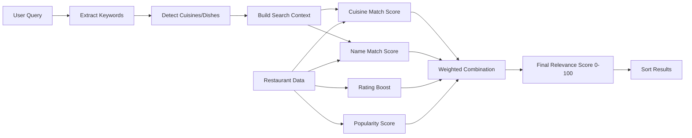
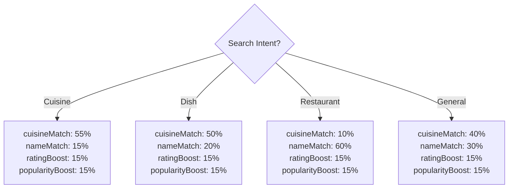

# Search Relevance Algorithm

## Overview

The relevance algorithm ensures that search results are ordered by how well they match the user's search intent. When searching for "Chinese", Chinese restaurants should appear at the top, not South Indian restaurants that happen to serve one Chinese dish.

## Relevance Scoring Flow



## Score Components

### 1. Cuisine Match Score (0-100)

**Weight**: 40% (default), 55% (cuisine searches), 50% (dish searches)

Evaluates how well the restaurant's cuisines match the search query.

| Match Type | Score |
|------------|-------|
| Exact cuisine match | 100 |
| Cuisine alias match (e.g., "Indo-Chinese" → "Chinese") | 95 |
| Related cuisine match | 80 |
| Dish-based cuisine match | 95 |
| Related cuisine for dish | 70 |
| Partial keyword match | 60 |
| No match (cuisine search) | 10 |
| No cuisine in query | 50 (neutral) |

### 2. Name Match Score (0-100)

**Weight**: 30% (default), 60% (restaurant searches), 15% (cuisine searches)

Evaluates how well the restaurant name matches the search query.

| Match Type | Score |
|------------|-------|
| Exact name match | 100 |
| Name starts with query | 80 |
| Name contains query | 50 |
| Keyword matches | 20-70 |
| Word-level matches | 20-60 |
| No match | 5-30 |

### 3. Rating Boost (0-100)

**Weight**: 15%

Rewards restaurants with higher ratings.

```
if rating < 3.5:
    score = 0
else:
    score = (rating - 3.5) / (5.0 - 3.5) * 100
    if rating >= 4.5:
        score *= 1.2  # 20% bonus for excellent ratings
```

### 4. Popularity Score (0-100)

**Weight**: 15%

Rewards restaurants with more reviews (more established).

```
if ratingCount < 100:
    score = 0
else:
    # Log scale: 100 → 0%, 1000 → 50%, 10000 → 100%
    score = log10(ratingCount) normalized to 0-100
```

## Cuisine Taxonomy

The algorithm uses a comprehensive taxonomy of Indian food delivery cuisines:

```typescript
{
  name: 'Chinese',
  aliases: ['indo-chinese', 'hakka', 'szechuan', 'pan-asian'],
  dishes: ['noodles', 'manchurian', 'fried rice', 'momos', ...],
  related: ['Asian', 'Thai', 'Japanese']
}
```

**Supported Cuisines**:
- Chinese / Indo-Chinese
- North Indian / Mughlai / Punjabi
- South Indian / Andhra / Kerala
- Biryani / Hyderabadi
- Italian / Pizza / Pasta
- Fast Food / American / Burgers
- Cafe / Bakery / Desserts
- Street Food / Chaat
- Thai / Japanese / Pan-Asian
- Healthy / Salads
- Seafood / Coastal
- Rolls / Wraps
- Beverages

## Query Analysis

### Keyword Extraction

```typescript
extractKeywords("best chinese food near me")
// → ['chinese', 'food', 'chinese food']
// (filters out: 'best', 'near', 'me')
```

### Intent Detection

| Query | Detected Intent | Cuisines |
|-------|-----------------|----------|
| "chinese" | Cuisine search | Chinese |
| "biryani" | Dish search | Biryani, North Indian |
| "Pizza Hut" | Restaurant search | - |
| "best food" | General search | - |

## Adaptive Weighting

Weights adjust based on detected search intent:



## Example: "Chinese" Search

### Before (No Relevance Scoring)
```
1. Meghana Foods (Biryani, Andhra) ❌
2. Empire Restaurant (North Indian) ❌
3. Chung Wah (Chinese) ✓
4. A2B (South Indian) ❌
5. Mainland China (Chinese) ✓
```

### After (With Relevance Scoring)
```
1. Mainland China (Chinese) - Score: 92
   └─ cuisineMatch: 40, nameMatch: 12, rating: 15, popularity: 15
2. Chung Wah (Chinese) - Score: 88
   └─ cuisineMatch: 40, nameMatch: 18, rating: 14, popularity: 12
3. Chinese Wok (Indo-Chinese) - Score: 82
   └─ cuisineMatch: 38, nameMatch: 20, rating: 12, popularity: 10
4. Empire Restaurant (has Chinese items) - Score: 35
   └─ cuisineMatch: 12, nameMatch: 8, rating: 10, popularity: 5
5. A2B (South Indian) - Score: 18
   └─ cuisineMatch: 4, nameMatch: 4, rating: 8, popularity: 2
```

## Integration with Matcher

The relevance score is calculated during the restaurant matching process:

```typescript
const comparisons = matchRestaurants(swiggyRestaurants, zomatoRestaurants, query);

// Each comparison now includes:
{
  matchId: "...",
  name: "Mainland China",
  swiggy: {...},
  zomato: {...},
  matchConfidence: 0.95,
  relevanceScore: {
    total: 92,
    breakdown: {
      cuisineMatch: 40,
      nameMatch: 12,
      ratingBoost: 15,
      popularityBoost: 15
    }
  }
}
```

## Sorting Priority

Results are sorted by:
1. **Relevance score** (primary) - Higher scores first
2. **Platform match** (secondary) - Matched on both platforms ranked higher
3. **Match confidence** (tertiary) - Higher confidence ranked higher
4. **Name** (final) - Alphabetical tiebreaker

## Relevance Tiers

| Tier | Score Range | Meaning |
|------|-------------|---------|
| Perfect | 90-100 | Exact match for search intent |
| High | 70-89 | Very relevant result |
| Medium | 30-69 | Somewhat relevant |
| Low | 0-29 | Not very relevant |

## Configuration

```typescript
// config.ts
export const SCORE_THRESHOLDS = {
  MINIMUM_RELEVANCE: 10,  // Below this, may be filtered
  HIGH_RELEVANCE: 70,     // Considered highly relevant
  PERFECT_MATCH: 90,      // Near-perfect match
};

export const RATING_CONFIG = {
  MIN_RATING: 3.5,               // Minimum to get any boost
  MAX_RATING: 5.0,               // Maximum rating
  EXCELLENT_RATING_THRESHOLD: 4.5,
  EXCELLENT_RATING_BONUS: 0.2,   // 20% extra for 4.5+
};

export const POPULARITY_CONFIG = {
  MIN_RATING_COUNT: 100,         // Minimum reviews for boost
  MAX_RATING_COUNT: 10000,       // Cap for max boost
};
```

## Future Improvements

1. **Machine Learning**: Train model on user click data
2. **Personalization**: Factor in user's past orders and preferences
3. **Location Awareness**: Boost restaurants closer to user
4. **Time-Based**: Boost breakfast places in morning, etc.
5. **Offer Awareness**: Consider current discounts/offers
6. **Freshness**: Boost recently popular restaurants
