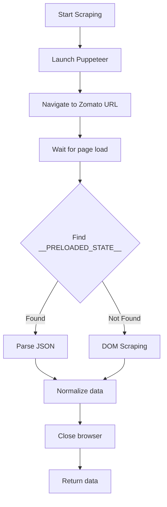

# Zomato Scraper Documentation

## Overview

Zomato does not provide a public API, so Sorted uses Puppeteer to scrape restaurant and menu data from Zomato's web pages. The scraper extracts data from the `__PRELOADED_STATE__` JavaScript object embedded in page HTML.

**Important**: Web scraping may violate Zomato's Terms of Service. Use responsibly and implement rate limiting.

## Scraping Strategy



## Configuration

```typescript
// src/lib/zomato/scraper.ts

const USER_AGENTS = [
  'Mozilla/5.0 (Windows NT 10.0; Win64; x64) AppleWebKit/537.36 Chrome/120.0.0.0',
  'Mozilla/5.0 (Macintosh; Intel Mac OS X 10_15_7) AppleWebKit/537.36 Chrome/120.0.0.0',
  'Mozilla/5.0 (X11; Linux x86_64) AppleWebKit/537.36 Chrome/120.0.0.0',
];

const PUPPETEER_OPTIONS = {
  headless: true,
  args: [
    '--no-sandbox',
    '--disable-setuid-sandbox',
    '--disable-dev-shm-usage',
    '--disable-gpu',
    '--window-size=1920,1080',
  ],
};
```

## Endpoints Scraped

### 1. Restaurant Search

**URL Pattern**: `https://www.zomato.com/{city}/delivery`

**Search URL**: `https://www.zomato.com/{city}/delivery?q={query}`

**Example**:
```
https://www.zomato.com/bangalore/delivery?q=biryani
```

### 2. Restaurant Menu

**URL Pattern**: `https://www.zomato.com/{city}/{restaurant-slug}/order`

**Example**:
```
https://www.zomato.com/bangalore/meghana-foods-koramangala/order
```

## Data Extraction

### __PRELOADED_STATE__ Structure

Zomato embeds application state in a script tag:

```html
<script>
  window.__PRELOADED_STATE__ = {
    "pages": {
      "current": {
        "pageType": "DELIVERY",
        "entity_id": "12345",
        "name": "Meghana Foods",
        "rating": {
          "aggregate_rating": 4.5,
          "votes": "10K+"
        },
        "cuisines": [
          { "name": "Biryani" },
          { "name": "Andhra" }
        ],
        "cfo": 400,
        "eta": "25-30 min",
        "locality": {
          "name": "Koramangala"
        },
        "thumb": "https://..."
      }
    },
    "entities": {
      "MENU": {
        "menus": {
          "regular": {
            "categories": [
              {
                "name": "Biryani",
                "items": [...]
              }
            ]
          }
        }
      }
    }
  };
</script>
```

### Extraction Code

```typescript
async function extractPreloadedState(page: Page): Promise<ZomatoState | null> {
  try {
    const stateScript = await page.$eval(
      'script:not([src])',
      (scripts) => {
        for (const script of document.querySelectorAll('script:not([src])')) {
          const content = script.textContent || '';
          if (content.includes('__PRELOADED_STATE__')) {
            const match = content.match(
              /window\.__PRELOADED_STATE__\s*=\s*({[\s\S]*?});?\s*(?:window\.|<\/script>|$)/
            );
            if (match) {
              return match[1];
            }
          }
        }
        return null;
      }
    );

    if (stateScript) {
      return JSON.parse(stateScript);
    }
  } catch (error) {
    console.error('Failed to extract __PRELOADED_STATE__:', error);
  }
  return null;
}
```

## Data Structures

### Restaurant Search Response

```typescript
interface ZomatoSearchState {
  pages: {
    current: {
      pageType: string;
      sections: Array<{
        type: string;
        items?: Array<{
          entity_id: string;
          name: string;
          rating: {
            aggregate_rating: number;
            votes: string;
          };
          cuisines: Array<{ name: string }>;
          cfo: number;
          eta: string;
          locality: { name: string };
          thumb: string;
        }>;
      }>;
    };
  };
}
```

### Restaurant Detail Response

```typescript
interface ZomatoRestaurantState {
  pages: {
    current: {
      entity_id: string;
      name: string;
      rating: {
        aggregate_rating: number;
        votes: string;
      };
      cuisines: Array<{ name: string }>;
      cfo: number;              // Cost for one
      eta: string;              // "25-30 min"
      locality: { name: string };
      thumb: string;
      resId: number;
    };
  };
  entities: {
    MENU: {
      menus: {
        regular: {
          categories: ZomatoCategory[];
        };
      };
    };
  };
}

interface ZomatoCategory {
  name: string;
  items: ZomatoMenuItem[];
}

interface ZomatoMenuItem {
  id: string;
  name: string;
  desc?: string;
  price: number;          // Already in rupees
  isVeg: number;          // 1 = veg, 0 = non-veg
  imageUrl?: string;
  rating?: {
    value: number;
    count: number;
  };
  inStock: boolean;
}
```

## Normalization

### Restaurant Normalization

```typescript
function normalizeZomatoRestaurant(
  item: ZomatoRestaurantItem,
  city: string
): NormalizedRestaurant {
  return {
    platform: 'zomato',
    platformId: item.entity_id.toString(),
    name: item.name,
    rating: item.rating?.aggregate_rating || 0,
    ratingCount: parseVotes(item.rating?.votes),
    costForTwo: item.cfo * 2,  // cfo is "cost for one"
    deliveryTime: parseDeliveryTime(item.eta),
    cuisines: item.cuisines?.map(c => c.name) || [],
    locality: item.locality?.name || '',
    image: item.thumb || null,
    isOpen: true,
    deepLink: `https://www.zomato.com/${city}/${generateSlug(item.name)}/order`,
  };
}

function parseVotes(votes: string): number {
  // "10K+" -> 10000
  const match = votes?.match(/(\d+(?:\.\d+)?)\s*([KM])?/i);
  if (!match) return 0;
  const num = parseFloat(match[1]);
  const multiplier = match[2]?.toUpperCase() === 'K' ? 1000 :
                     match[2]?.toUpperCase() === 'M' ? 1000000 : 1;
  return Math.round(num * multiplier);
}

function parseDeliveryTime(eta: string): number {
  // "25-30 min" -> 27 (average)
  const match = eta?.match(/(\d+)(?:-(\d+))?\s*min/i);
  if (!match) return 0;
  const min = parseInt(match[1]);
  const max = match[2] ? parseInt(match[2]) : min;
  return Math.round((min + max) / 2);
}
```

### Menu Item Normalization

```typescript
function normalizeZomatoMenuItem(item: ZomatoMenuItem): NormalizedMenuItem {
  return {
    platform: 'zomato',
    platformId: item.id.toString(),
    name: item.name,
    description: item.desc || '',
    price: item.price,  // Already in rupees
    isVeg: item.isVeg === 1,
    image: item.imageUrl || null,
    inStock: item.inStock !== false,
    rating: item.rating?.value || 0,
  };
}
```

## Scraper Implementation

```typescript
// src/lib/zomato/scraper.ts

export async function searchZomatoRestaurants(
  lat: number,
  lng: number,
  query: string,
  city: string
): Promise<NormalizedRestaurant[]> {
  const browser = await puppeteer.launch(PUPPETEER_OPTIONS);

  try {
    const page = await browser.newPage();

    // Set random user agent
    await page.setUserAgent(
      USER_AGENTS[Math.floor(Math.random() * USER_AGENTS.length)]
    );

    // Set geolocation
    await page.setGeolocation({ latitude: lat, longitude: lng });

    // Navigate to search page
    const url = `https://www.zomato.com/${city}/delivery${query ? `?q=${encodeURIComponent(query)}` : ''}`;
    await page.goto(url, { waitUntil: 'networkidle2', timeout: 30000 });

    // Extract __PRELOADED_STATE__
    const state = await extractPreloadedState(page);

    if (!state) {
      console.warn('No __PRELOADED_STATE__ found, falling back to DOM');
      return await scrapeFromDOM(page, city);
    }

    // Extract and normalize restaurants
    const restaurants = extractRestaurantsFromState(state);
    return restaurants.map(r => normalizeZomatoRestaurant(r, city));

  } finally {
    await browser.close();
  }
}

export async function getZomatoMenu(
  restaurantSlug: string,
  city: string
): Promise<{ categories: string[]; items: NormalizedMenuItem[] }> {
  const browser = await puppeteer.launch(PUPPETEER_OPTIONS);

  try {
    const page = await browser.newPage();
    await page.setUserAgent(
      USER_AGENTS[Math.floor(Math.random() * USER_AGENTS.length)]
    );

    const url = `https://www.zomato.com/${city}/${restaurantSlug}/order`;
    await page.goto(url, { waitUntil: 'networkidle2', timeout: 45000 });

    const state = await extractPreloadedState(page);

    if (!state?.entities?.MENU) {
      return { categories: [], items: [] };
    }

    return extractMenuFromState(state);

  } finally {
    await browser.close();
  }
}
```

## DOM Fallback Scraping

When `__PRELOADED_STATE__` is unavailable:

```typescript
async function scrapeFromDOM(
  page: Page,
  city: string
): Promise<NormalizedRestaurant[]> {
  // Find restaurant cards
  const restaurants = await page.$$eval(
    '[data-testid="restaurant-card"]',
    (cards) => {
      return cards.map(card => ({
        name: card.querySelector('[data-testid="res-name"]')?.textContent || '',
        rating: card.querySelector('[data-testid="rating"]')?.textContent || '0',
        cuisines: card.querySelector('[data-testid="cuisines"]')?.textContent || '',
        eta: card.querySelector('[data-testid="eta"]')?.textContent || '',
        cfo: card.querySelector('[data-testid="cfo"]')?.textContent || '',
        image: card.querySelector('img')?.src || '',
      }));
    }
  );

  return restaurants.map(r => ({
    platform: 'zomato',
    platformId: generateId(r.name),
    name: r.name,
    rating: parseFloat(r.rating) || 0,
    // ... normalize other fields
  }));
}
```

## Anti-Bot Measures

### Detection Avoidance

```typescript
// Randomize timing
await page.waitForTimeout(Math.random() * 2000 + 1000);

// Mouse movement simulation
await page.mouse.move(
  Math.random() * 800 + 100,
  Math.random() * 600 + 100
);

// Scroll simulation
await page.evaluate(() => {
  window.scrollBy(0, Math.random() * 500 + 200);
});
```

### Puppeteer Stealth

Consider using `puppeteer-extra-plugin-stealth`:

```typescript
import puppeteer from 'puppeteer-extra';
import StealthPlugin from 'puppeteer-extra-plugin-stealth';

puppeteer.use(StealthPlugin());
```

## Error Handling

```typescript
try {
  const restaurants = await searchZomatoRestaurants(lat, lng, query, city);
  return restaurants;
} catch (error) {
  if (error.message.includes('timeout')) {
    console.error('Zomato page load timeout');
  } else if (error.message.includes('net::ERR')) {
    console.error('Network error accessing Zomato');
  }
  // Return empty array, don't fail the request
  return [];
}
```

## Deep Links

```typescript
function getZomatoDeepLink(restaurant: ZomatoRestaurant, city: string): string {
  const slug = restaurant.name
    .toLowerCase()
    .replace(/[^a-z0-9]+/g, '-')
    .replace(/^-|-$/g, '');

  return `https://www.zomato.com/${city}/${slug}/order`;
}
```

## Performance Considerations

1. **Browser Reuse**: Consider pooling Puppeteer instances for high traffic
2. **Caching**: Cache scraped data aggressively (30-60 min)
3. **Timeout Management**: Set appropriate timeouts for page loads
4. **Memory**: Close browsers properly to prevent memory leaks

## Known Issues

1. **Captcha**: Zomato may show captcha for suspicious activity
2. **Location Accuracy**: Geolocation may not always work
3. **Dynamic Content**: Some data loads via JavaScript after initial render
4. **Rate Limiting**: Too many requests trigger blocks
5. **HTML Changes**: DOM structure changes frequently
6. **Mobile Detection**: May redirect to mobile site on some user agents
