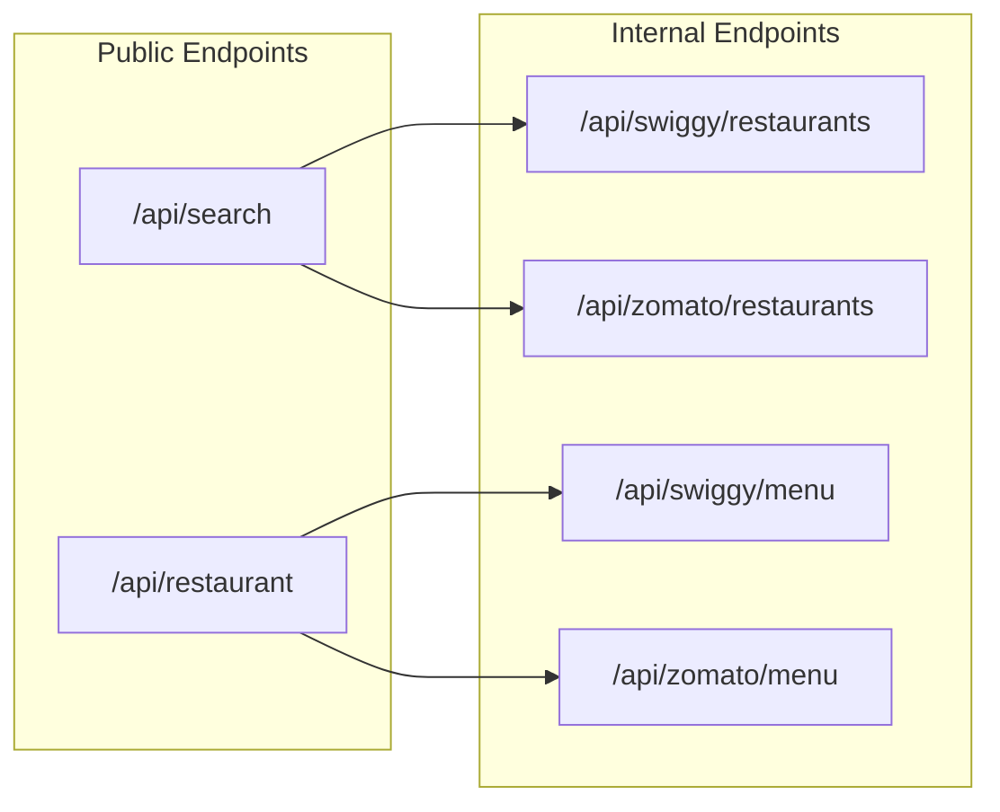
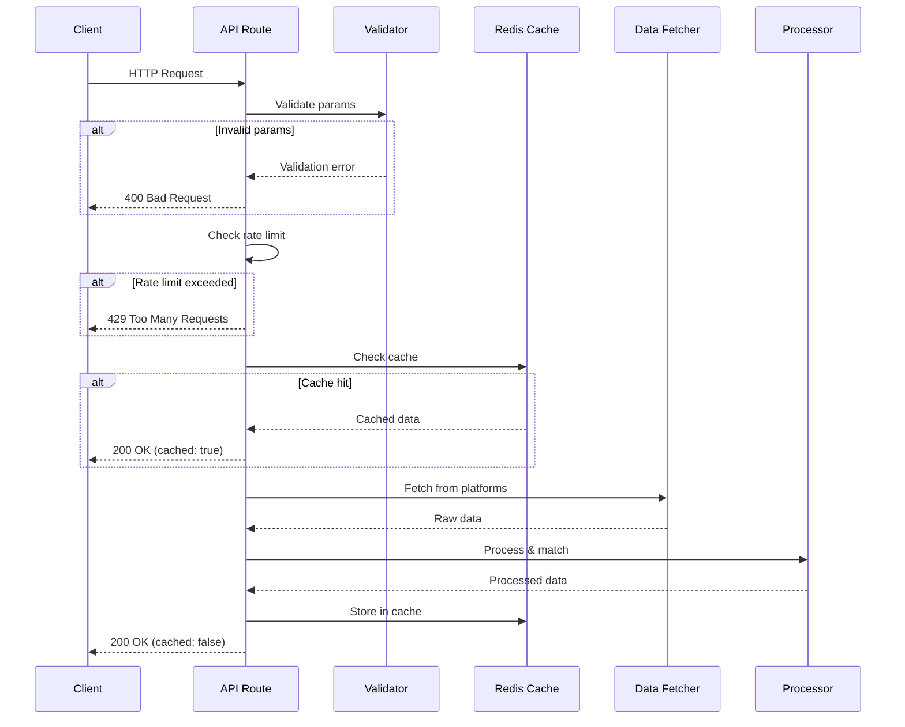

# API Routes Documentation

## Overview

All API routes are implemented as Next.js Route Handlers in the `/src/app/api/` directory.



---

## Public Endpoints

### GET /api/search

Unified search endpoint that fetches from both platforms, matches restaurants, and returns comparison data.

#### Request

```http
GET /api/search?q=biryani&lat=12.9716&lng=77.5946&city=bangalore
```

| Parameter | Type | Required | Description |
|-----------|------|----------|-------------|
| `q` | string | Yes | Search query (min 2 chars) |
| `lat` | number | Yes | Latitude (-90 to 90) |
| `lng` | number | Yes | Longitude (-180 to 180) |
| `city` | string | No | City name for Zomato |

#### Response

```typescript
interface SearchResponse {
  success: boolean;
  query: string;
  location: {
    lat: number;
    lng: number;
    city?: string;
  };
  comparisons: ComparisonRestaurant[];
  stats: {
    totalSwiggy: number;
    totalZomato: number;
    matched: number;
    swiggyOnly: number;
    zomatoOnly: number;
  };
  cached: boolean;
}

interface ComparisonRestaurant {
  id: string;
  name: string;
  swiggy?: NormalizedRestaurant;
  zomato?: NormalizedRestaurant;
  matchConfidence?: number;
  cuisines: string[];
  bestRating: number;
  bestDeliveryTime: number;
  lowestCostForTwo: number;
}
```

#### Example Response

```json
{
  "success": true,
  "query": "biryani",
  "location": { "lat": 12.9716, "lng": 77.5946, "city": "bangalore" },
  "comparisons": [
    {
      "id": "meghana-foods-koramangala",
      "name": "Meghana Foods",
      "swiggy": {
        "platform": "swiggy",
        "platformId": "12345",
        "name": "Meghana Foods",
        "rating": 4.5,
        "ratingCount": 10000,
        "costForTwo": 400,
        "deliveryTime": 25,
        "cuisines": ["Biryani", "Andhra"],
        "locality": "Koramangala",
        "image": "https://...",
        "deepLink": "https://swiggy.com/restaurants/meghana-foods-12345"
      },
      "zomato": {
        "platform": "zomato",
        "platformId": "67890",
        "name": "Meghana Foods - Koramangala",
        "rating": 4.4,
        "ratingCount": 8500,
        "costForTwo": 450,
        "deliveryTime": 30,
        "cuisines": ["Biryani", "South Indian"],
        "locality": "Koramangala",
        "image": "https://...",
        "deepLink": "https://zomato.com/bangalore/meghana-foods-koramangala/order"
      },
      "matchConfidence": 0.92,
      "cuisines": ["Biryani", "Andhra", "South Indian"],
      "bestRating": 4.5,
      "bestDeliveryTime": 25,
      "lowestCostForTwo": 400
    }
  ],
  "stats": {
    "totalSwiggy": 20,
    "totalZomato": 18,
    "matched": 15,
    "swiggyOnly": 5,
    "zomatoOnly": 3
  },
  "cached": false
}
```

#### Rate Limiting

- **Limit**: 20 requests per minute per IP
- **Headers**: `X-RateLimit-Remaining`, `X-RateLimit-Reset`

#### Error Responses

| Status | Reason |
|--------|--------|
| 400 | Missing or invalid parameters |
| 429 | Rate limit exceeded |
| 500 | Internal server error |

---

### GET /api/restaurant

Menu comparison endpoint that fetches menus from both platforms and matches items.

#### Request

```http
GET /api/restaurant?swiggy_id=12345&zomato_slug=meghana-foods&lat=12.97&lng=77.59&city=bangalore
```

| Parameter | Type | Required | Description |
|-----------|------|----------|-------------|
| `swiggy_id` | string | No* | Swiggy restaurant ID |
| `zomato_slug` | string | No* | Zomato restaurant slug |
| `lat` | number | Yes | Latitude |
| `lng` | number | Yes | Longitude |
| `city` | string | No | City name (for Zomato) |

*At least one of `swiggy_id` or `zomato_slug` is required.

#### Response

```typescript
interface RestaurantResponse {
  success: boolean;
  swiggyId?: string;
  zomatoSlug?: string;
  menuComparison: ComparisonMenuItem[];
  categories: string[];
  stats: {
    totalSwiggyItems: number;
    totalZomatoItems: number;
    matchedItems: number;
    swiggyOnlyItems: number;
    zomatoOnlyItems: number;
  };
  pricing: {
    swiggyTotal: number;
    zomatoTotal: number;
    optimalTotal: number;
    totalSavings: number;
  };
  swiggyLink?: string;
  zomatoLink?: string;
  cached: boolean;
}

interface ComparisonMenuItem {
  id: string;
  name: string;
  category: string;
  isVeg: boolean;
  swiggy?: NormalizedMenuItem;
  zomato?: NormalizedMenuItem;
  priceDifference?: number;
  cheaperPlatform?: 'swiggy' | 'zomato' | 'same';
}
```

#### Rate Limiting

- **Limit**: 15 requests per minute per IP

---

## Internal Endpoints

These endpoints are used internally by the public endpoints but can also be called directly for debugging.

### GET /api/swiggy/restaurants

Fetches restaurant listings from Swiggy.

```http
GET /api/swiggy/restaurants?lat=12.97&lng=77.59&q=biryani
```

### GET /api/swiggy/menu

Fetches menu for a specific Swiggy restaurant.

```http
GET /api/swiggy/menu?restaurantId=12345&lat=12.97&lng=77.59
```

### GET /api/zomato/restaurants

Scrapes restaurant listings from Zomato.

```http
GET /api/zomato/restaurants?lat=12.97&lng=77.59&q=biryani&city=bangalore
```

### GET /api/zomato/menu

Scrapes menu for a specific Zomato restaurant.

```http
GET /api/zomato/menu?restaurantSlug=meghana-foods&city=bangalore
```

---

## Request/Response Cycle



---

## Error Handling

All endpoints return errors in a consistent format:

```typescript
interface ErrorResponse {
  success: false;
  error: string;
  details?: string;
}
```

### Common Error Codes

| Code | Meaning | Example |
|------|---------|---------|
| 400 | Bad Request | Missing `q` parameter |
| 404 | Not Found | Restaurant not found |
| 429 | Rate Limited | Too many requests |
| 500 | Server Error | Scraper failure |
| 503 | Service Unavailable | Platform unreachable |

---

## CORS Configuration

All API routes are configured to accept requests from:
- Same origin (production)
- `localhost:3000` (development)

No external origins are allowed to prevent abuse.

---

## Caching Strategy

| Endpoint | Cache Key | TTL |
|----------|-----------|-----|
| `/api/search` | `unified_search:{md5(q+lat+lng)}` | 15 min |
| `/api/restaurant` | `menu_comparison:{md5(ids+lat+lng)}` | 30 min |
| `/api/swiggy/menu` | `menu:swiggy:{restaurantId}` | 30 min |
| `/api/zomato/menu` | `menu:zomato:{slug}` | 30 min |

---

## Timeouts

| Endpoint | Timeout |
|----------|---------|
| `/api/search` | 60 seconds |
| `/api/restaurant` | 60 seconds |
| `/api/swiggy/*` | 30 seconds |
| `/api/zomato/*` | 45 seconds (Puppeteer) |
