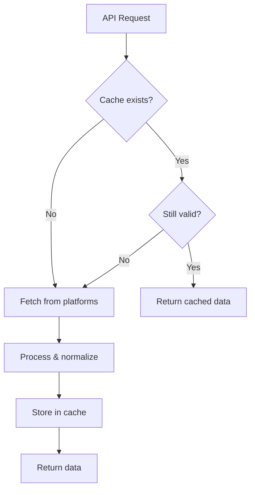
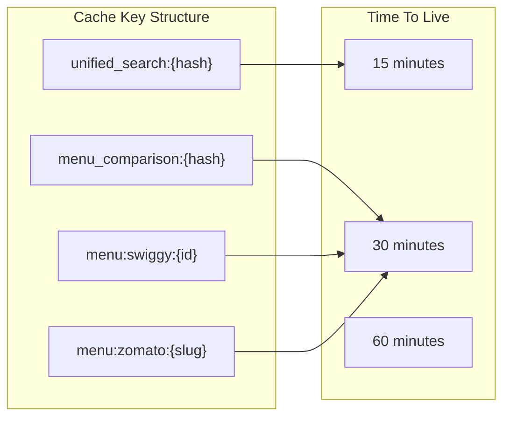
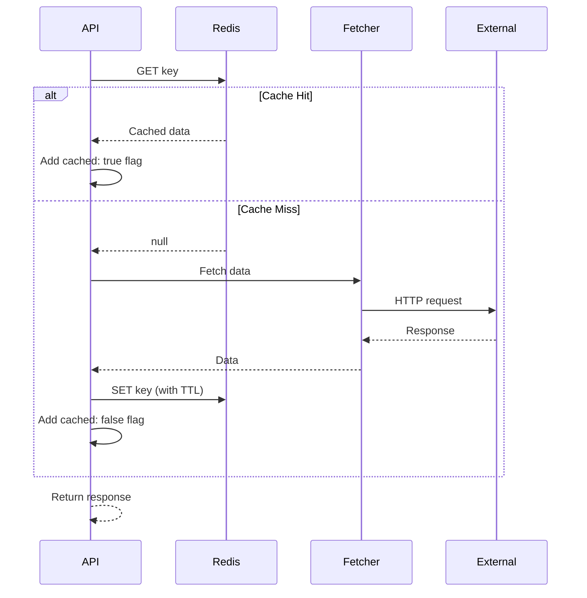
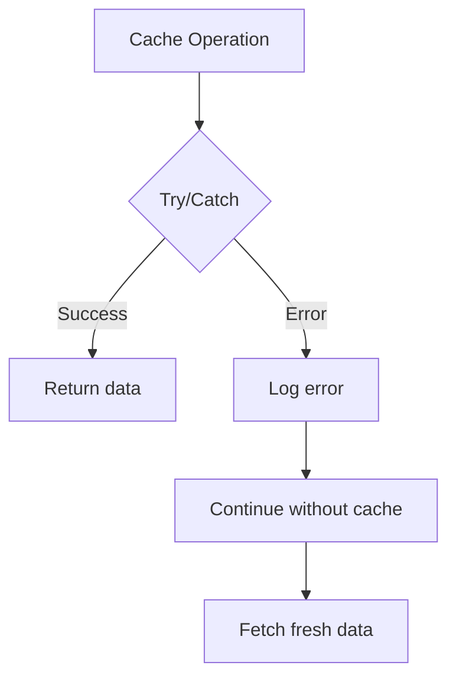

# Caching Strategy

## Overview

Sorted uses Upstash Redis for caching to reduce external API calls, improve response times, and protect against rate limiting from Swiggy and Zomato.



## Cache Configuration

### Provider: Upstash Redis

**Why Upstash?**
- Serverless-friendly (REST API)
- Free tier: 10,000 commands/day
- Low latency from edge locations
- No connection management needed

**Connection**:
```typescript
// src/lib/cache/redis.ts
import { Redis } from '@upstash/redis';

export const redis = new Redis({
  url: process.env.UPSTASH_REDIS_REST_URL!,
  token: process.env.UPSTASH_REDIS_REST_TOKEN!,
});
```

## Cache Keys and TTLs



### Key Generation

Cache keys are generated using MD5 hashes of sorted parameters to ensure consistency:

```typescript
function generateCacheKey(prefix: string, params: Record<string, string>): string {
  const sortedParams = Object.keys(params)
    .sort()
    .map(k => `${k}=${params[k]}`)
    .join('&');

  const hash = crypto.createHash('md5').update(sortedParams).digest('hex');
  return `${prefix}:${hash}`;
}
```

### TTL Strategy

| Data Type | TTL | Rationale |
|-----------|-----|-----------|
| Search Results | 15 min | Restaurant availability changes frequently |
| Menu Comparison | 30 min | Menu items change less often |
| Individual Menu | 30 min | Prices may update |
| Restaurant Details | 60 min | Static info rarely changes |

## Cache Operations

### Read-Through Pattern



### Cache Functions

```typescript
// Get with automatic JSON parsing
async function getCached<T>(key: string): Promise<T | null> {
  try {
    const data = await redis.get(key);
    return data as T | null;
  } catch (error) {
    console.error('Cache get error:', error);
    return null;
  }
}

// Set with TTL and JSON serialization
async function setCached<T>(
  key: string,
  data: T,
  ttlSeconds: number
): Promise<void> {
  try {
    await redis.set(key, JSON.stringify(data), { ex: ttlSeconds });
  } catch (error) {
    console.error('Cache set error:', error);
    // Continue without caching - graceful degradation
  }
}
```

## Cached Data Structures

### Search Results Cache

```typescript
interface CachedSearchResult {
  query: string;
  location: { lat: number; lng: number; city?: string };
  comparisons: ComparisonRestaurant[];
  stats: SearchStats;
  timestamp: number;
}
```

### Menu Comparison Cache

```typescript
interface CachedMenuComparison {
  swiggyId?: string;
  zomatoSlug?: string;
  menuComparison: ComparisonMenuItem[];
  categories: string[];
  stats: MenuStats;
  pricing: PricingInfo;
  timestamp: number;
}
```

## Cache Invalidation

### Automatic Expiration
All cached data expires automatically based on TTL. No manual invalidation needed for normal operations.

### Manual Invalidation (Admin)
For cases where immediate invalidation is needed:

```typescript
async function invalidateSearchCache(query: string, lat: number, lng: number) {
  const key = generateCacheKey('unified_search', {
    q: query,
    lat: lat.toString(),
    lng: lng.toString()
  });
  await redis.del(key);
}
```

## Error Handling

### Graceful Degradation



The cache layer is designed to fail silently:
- Cache read failures return `null` (cache miss behavior)
- Cache write failures don't block the response
- All errors are logged for monitoring

```typescript
async function getCached<T>(key: string): Promise<T | null> {
  try {
    return await redis.get(key) as T;
  } catch (error) {
    console.error(`Cache read error for ${key}:`, error);
    return null; // Treat as cache miss
  }
}
```

## Performance Metrics

### Cache Hit Ratio Target
- **Search**: > 60% (many repeated searches)
- **Menu**: > 70% (users often compare same restaurants)

### Response Time Impact
| Scenario | Avg Response Time |
|----------|-------------------|
| Cache Hit | ~50-100ms |
| Cache Miss | ~2-5 seconds |

## Monitoring

### Key Metrics to Track
1. **Hit Rate**: `cache_hits / (cache_hits + cache_misses)`
2. **Latency**: Time for cache operations
3. **Error Rate**: Failed cache operations
4. **Memory Usage**: Upstash dashboard

### Logging
```typescript
// Log cache status in response
{
  success: true,
  cached: true,  // or false
  cacheAge: 847, // seconds since cached (if hit)
  // ... data
}
```

## Future Improvements

### 1. Cache Warming
Pre-populate cache for popular searches:
```typescript
async function warmCache() {
  const popularSearches = ['biryani', 'pizza', 'chinese'];
  const popularCities = ['bangalore', 'mumbai', 'delhi'];

  for (const query of popularSearches) {
    for (const city of popularCities) {
      await searchWithCache(query, cityCoordinates[city]);
    }
  }
}
```

### 2. Stale-While-Revalidate
Return stale data immediately while refreshing in background:
```typescript
async function getWithSWR<T>(key: string, fetcher: () => Promise<T>) {
  const cached = await getCached<T>(key);

  if (cached) {
    // Return immediately, refresh in background
    refreshInBackground(key, fetcher);
    return { data: cached, stale: true };
  }

  const fresh = await fetcher();
  await setCached(key, fresh, TTL);
  return { data: fresh, stale: false };
}
```

### 3. Regional Cache
Use Upstash's global replication for lower latency:
- Primary in Mumbai (closest to Indian users)
- Replicas in other regions

### 4. Cache Compression
For large payloads, compress before storing:
```typescript
import { compress, decompress } from 'lz-string';

async function setCompressed(key: string, data: object, ttl: number) {
  const compressed = compress(JSON.stringify(data));
  await redis.set(key, compressed, { ex: ttl });
}
```
