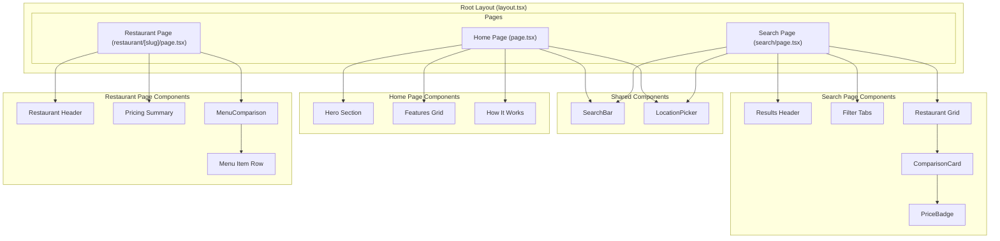
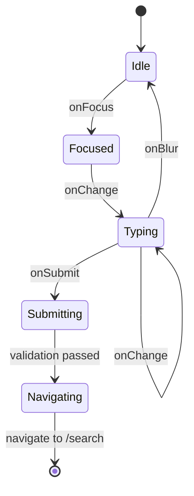
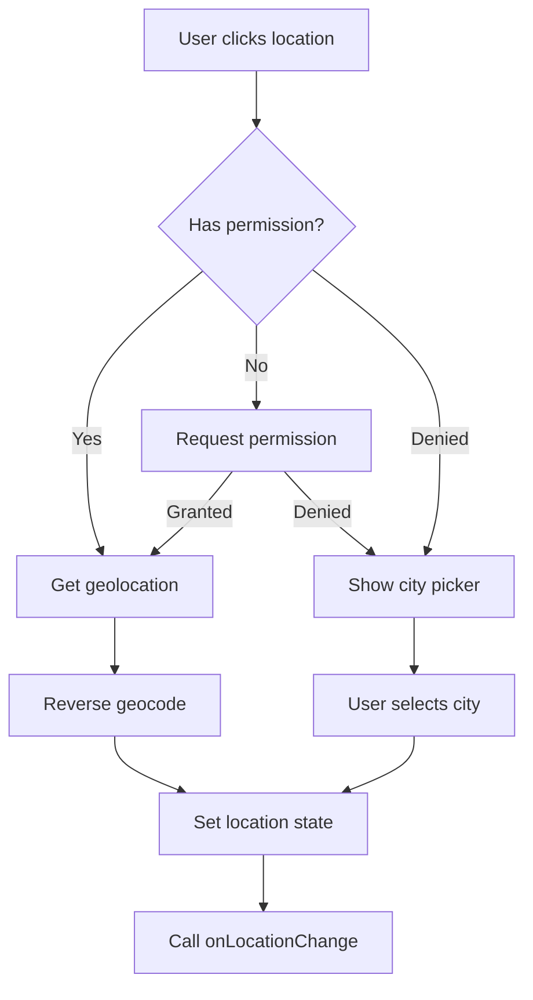
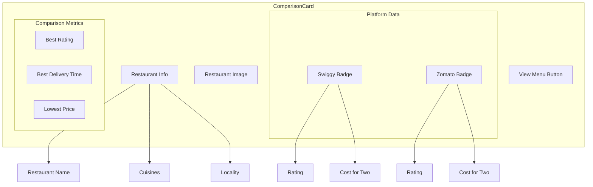
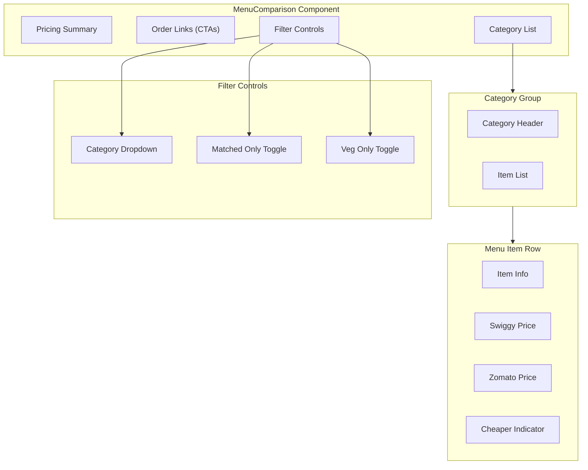
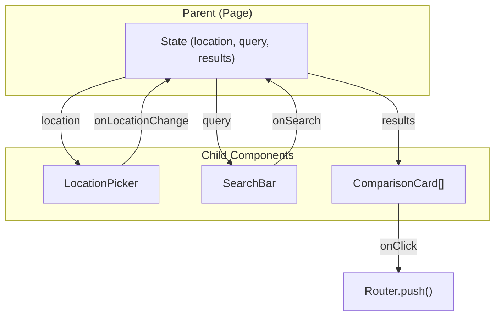

# Component Architecture

## Component Hierarchy



---

## Core Components

### SearchBar

**File**: `src/components/SearchBar.tsx`

**Purpose**: Search input with suggestions and form submission.



**Props**:
```typescript
interface SearchBarProps {
  initialQuery?: string;
  onSearch?: (query: string) => void;
  placeholder?: string;
  className?: string;
}
```

**Features**:
- Query validation (min 2 characters)
- Form submission handling
- Keyboard navigation
- Loading state during search

---

### LocationPicker

**File**: `src/components/LocationPicker.tsx`

**Purpose**: City and coordinate selection with geolocation support.



**Props**:
```typescript
interface LocationPickerProps {
  onLocationChange: (location: Location) => void;
  initialLocation?: Location;
}

interface Location {
  lat: number;
  lng: number;
  city: string;
  locality?: string;
}
```

**Supported Cities**:
- Bangalore
- Mumbai
- Delhi
- Chennai
- Hyderabad
- Pune
- Kolkata

---

### ComparisonCard

**File**: `src/components/ComparisonCard.tsx`

**Purpose**: Display a restaurant comparison with platform badges and price differences.



**Props**:
```typescript
interface ComparisonCardProps {
  comparison: ComparisonRestaurant;
  lat: number;
  lng: number;
  city: string;
}
```

**Visual States**:
- **Matched**: Shows both platforms
- **Swiggy Only**: Shows Swiggy badge only
- **Zomato Only**: Shows Zomato badge only
- **Best Deal**: Highlights platform with lower price

---

### MenuComparison

**File**: `src/components/MenuComparison.tsx`

**Purpose**: Side-by-side menu item comparison with filtering and sorting.



**Props**:
```typescript
interface MenuComparisonProps {
  menuItems: ComparisonMenuItem[];
  categories: string[];
  pricing: {
    swiggyTotal: number;
    zomatoTotal: number;
    optimalTotal: number;
    totalSavings: number;
  };
  swiggyLink?: string;
  zomatoLink?: string;
}
```

**Features**:
- Category filtering
- Veg/non-veg filtering
- Matched-only filtering
- Price difference highlighting
- Order links to both platforms

---

### PriceBadge

**File**: `src/components/PriceBadge.tsx`

**Purpose**: Visual indicator for price comparisons.

**Props**:
```typescript
interface PriceBadgeProps {
  swiggyPrice?: number;
  zomatoPrice?: number;
  showDifference?: boolean;
}
```

**Visual Variants**:
- **Swiggy Cheaper**: Orange highlight
- **Zomato Cheaper**: Red highlight
- **Same Price**: Gray/neutral
- **Single Platform**: Platform color

---

## Page Components

### Home Page (`src/app/page.tsx`)

**Structure**:
```
├── Header (fixed)
│   ├── Logo
│   └── LocationPicker
├── Hero Section
│   ├── Heading
│   ├── Subheading
│   └── SearchBar
├── Features Section
│   ├── Compare Prices Card
│   ├── Find Best Deals Card
│   └── Save Money Card
└── How It Works Section
    ├── Step 1: Search
    ├── Step 2: Compare
    ├── Step 3: Choose
    └── Step 4: Order
```

### Search Page (`src/app/search/page.tsx`)

**Structure**:
```
├── Header (sticky)
│   ├── Logo
│   ├── SearchBar (condensed)
│   └── LocationPicker
├── Results Header
│   ├── Query display
│   └── Result count
├── Filter Tabs
│   ├── All
│   ├── Matched (count)
│   ├── Swiggy Only (count)
│   └── Zomato Only (count)
├── Restaurant Grid
│   └── ComparisonCard[] (2-3 columns)
└── Empty State (if no results)
```

**State**:
```typescript
interface SearchPageState {
  results: ComparisonRestaurant[];
  loading: boolean;
  error: string | null;
  filter: 'all' | 'matched' | 'swiggy' | 'zomato';
  stats: SearchStats;
}
```

### Restaurant Page (`src/app/restaurant/[slug]/page.tsx`)

**Structure**:
```
├── Header
│   └── Breadcrumb (Home > Search > Restaurant)
├── Restaurant Header
│   ├── Name
│   ├── Platform Badges
│   └── Item Counts
├── Pricing Summary
│   ├── Swiggy Total
│   ├── Zomato Total
│   ├── Optimal Total
│   └── Potential Savings
├── Order Links
│   ├── Order on Swiggy CTA
│   └── Order on Zomato CTA
├── Filters
│   ├── Category Dropdown
│   ├── Matched Only Toggle
│   └── Veg Only Toggle
└── Menu Items (grouped by category)
    └── MenuItemRow[]
```

---

## Component Communication



---

## Styling Approach

### Tailwind Classes
All components use Tailwind CSS utility classes directly:

```tsx
// Example from ComparisonCard
<div className="bg-white rounded-lg shadow-md hover:shadow-lg transition-shadow">
  
  <div className="p-4">
    <h3 className="text-lg font-semibold text-gray-900">{name}</h3>
  </div>
</div>
```

### Responsive Breakpoints
- **Mobile**: < 640px (default)
- **Tablet**: >= 640px (`sm:`)
- **Desktop**: >= 1024px (`lg:`)

### Color Scheme
- **Swiggy**: `#FC8019` (orange)
- **Zomato**: `#E23744` (red)
- **Neutral**: Gray scale
- **Success**: Green
- **Error**: Red

---

## Future Components (Planned)

### Phase 3: Filter Components
- `FilterBar`
- `CuisineFilter`
- `DietaryFilter`
- `PriceFilter`
- `RatingFilter`
- `DeliveryTimeFilter`
- `SortDropdown`
- `ActiveFilters`

### Phase 4: UI Enhancements
- `Skeleton` (loading states)
- `EmptyState`
- `ErrorState`
- `Header` (unified)
- `Footer`
- `MobileFilterDrawer`
