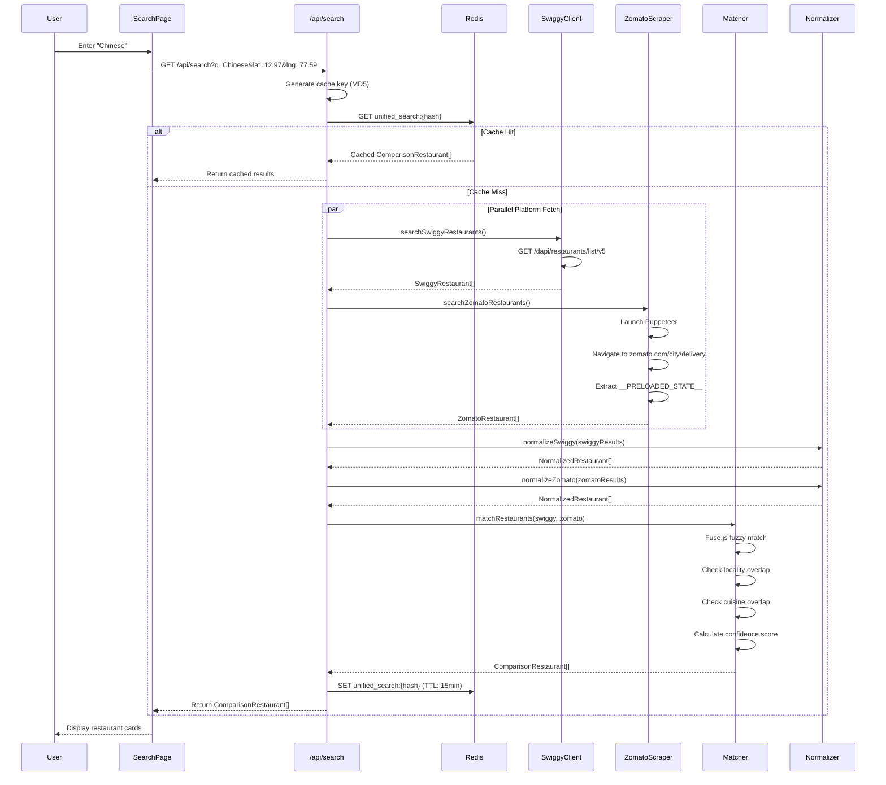
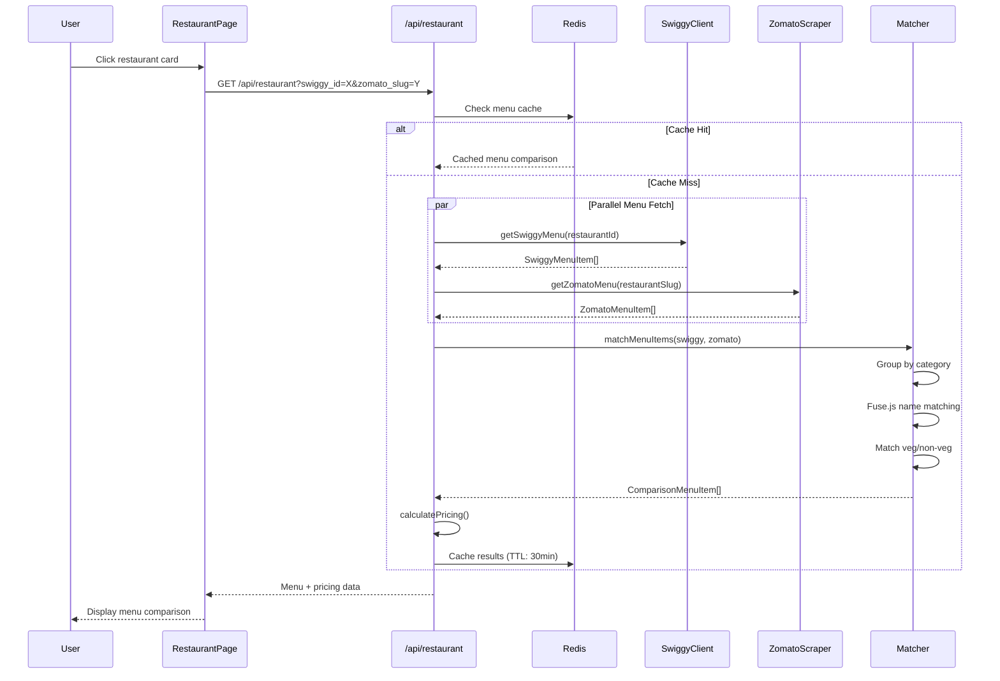
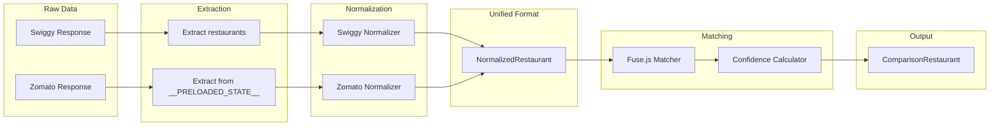
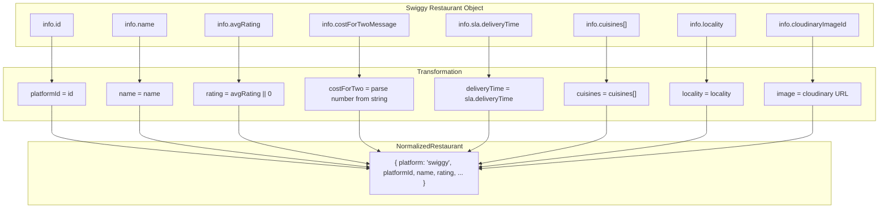
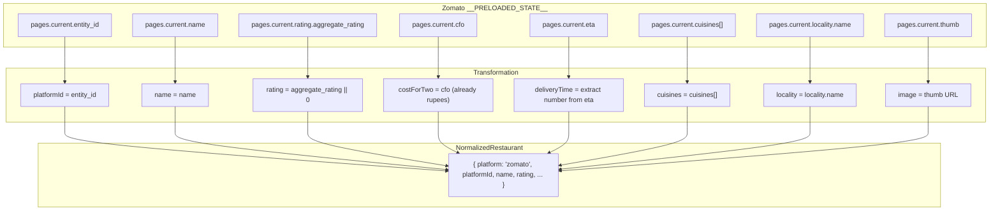
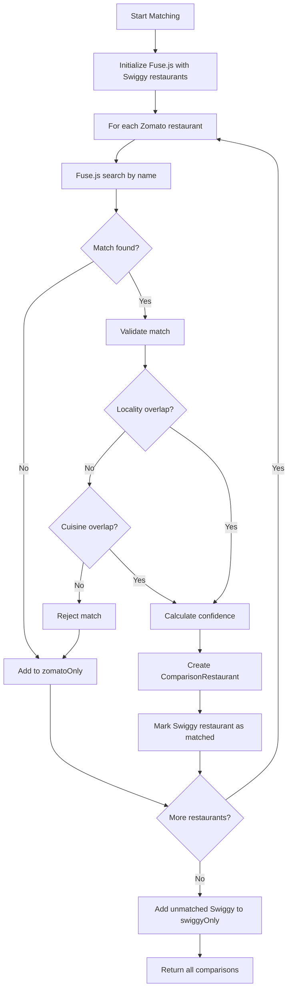
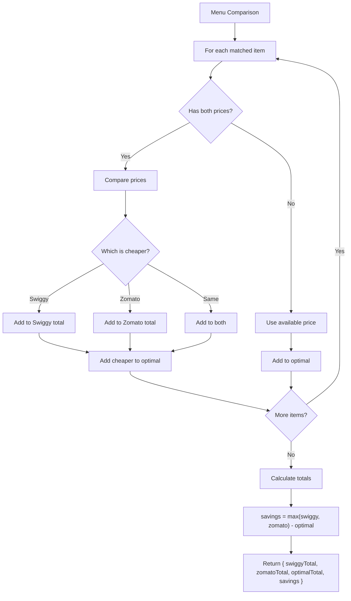
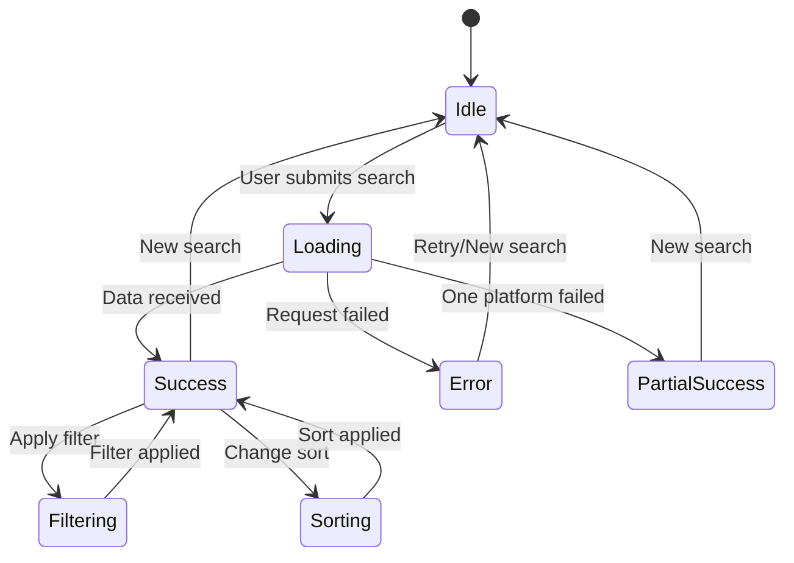
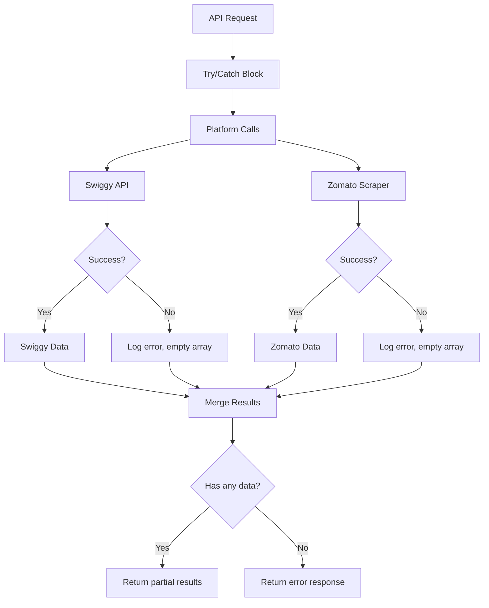

# Data Flow Documentation

## Search Flow

## Menu Comparison Flow

## Data Transformation Pipeline

## Normalization Details

### Swiggy to NormalizedRestaurant

### Zomato to NormalizedRestaurant

## Matching Algorithm Flow

## Price Calculation Flow

## State Management

## Error Handling Flow

