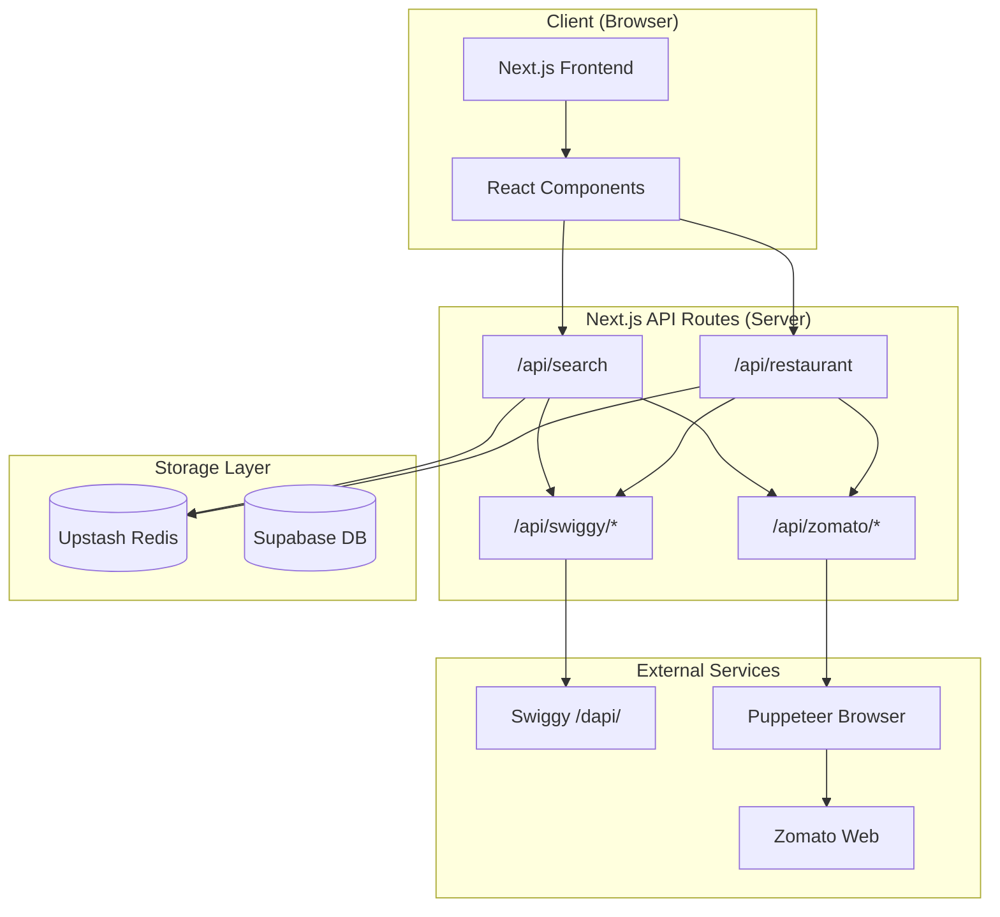
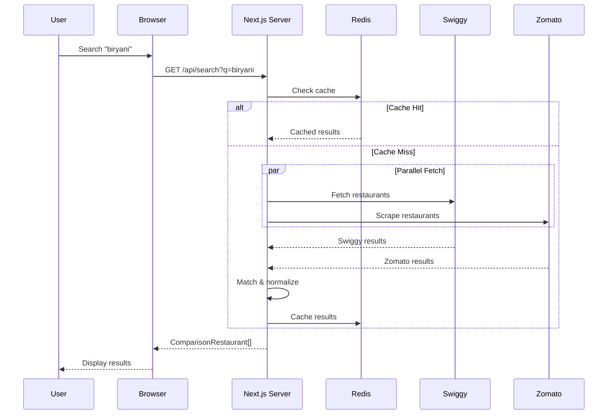

# Sorted Architecture Overview

## High-Level Architecture



## System Components

### Frontend Layer
| Component | Technology | Purpose |
|-----------|------------|---------|
| Pages | Next.js App Router | SSR/SSG page rendering |
| Components | React 19 | UI building blocks |
| Styling | Tailwind CSS 4 | Utility-first CSS |
| State | React hooks | Local state management |

### API Layer
| Route | Purpose | External Calls |
|-------|---------|----------------|
| `/api/search` | Unified search | Swiggy + Zomato |
| `/api/restaurant` | Menu comparison | Swiggy + Zomato |
| `/api/swiggy/*` | Swiggy proxy | Swiggy /dapi/ |
| `/api/zomato/*` | Zomato scraper | Puppeteer |

### Data Layer
| Service | Purpose | TTL |
|---------|---------|-----|
| Upstash Redis | Response caching | 15-60 min |
| Supabase | User data (future) | Persistent |

## Request Flow



## Key Design Decisions

### 1. Server-Side Data Fetching
All external API calls happen on the server (Next.js API routes) to:
- Avoid CORS issues with Swiggy's API
- Hide scraping logic from client
- Enable caching at the edge
- Protect API keys and credentials

### 2. Parallel Data Fetching
Swiggy and Zomato requests are made in parallel using `Promise.allSettled` to:
- Minimize response time
- Handle partial failures gracefully
- Still return results if one platform fails

### 3. Fuzzy Matching with Fuse.js
Cross-platform restaurant matching uses Fuse.js because:
- Handles name variations (e.g., "KFC" vs "Kentucky Fried Chicken")
- Configurable threshold for match quality
- Lightweight, runs on server

### 4. Redis Caching Strategy
Aggressive caching reduces external API calls:
- Search results: 15 minutes
- Menu data: 30 minutes
- Restaurant details: 1 hour

### 5. Puppeteer for Zomato
Zomato doesn't have a public API, so we:
- Use Puppeteer to render pages
- Extract `__PRELOADED_STATE__` from script tags
- Fall back to DOM scraping if needed

## Folder Structure

```
sorted/
├── src/
│   ├── app/                    # Next.js App Router
│   │   ├── page.tsx            # Landing page
│   │   ├── search/             # Search results
│   │   ├── restaurant/         # Restaurant detail
│   │   └── api/                # API routes
│   │       ├── search/         # Unified search
│   │       ├── restaurant/     # Menu comparison
│   │       ├── swiggy/         # Swiggy proxy
│   │       └── zomato/         # Zomato scraper
│   ├── components/             # React components
│   └── lib/                    # Business logic
│       ├── swiggy/             # Swiggy client
│       ├── zomato/             # Zomato scraper
│       ├── comparison/         # Matching logic
│       └── cache/              # Redis utilities
├── docs/                       # Documentation
└── public/                     # Static assets
```

## Security Considerations

### Rate Limiting
- `/api/search`: 20 requests/minute per IP
- `/api/restaurant`: 15 requests/minute per IP
- Implemented via in-memory tracking

### Input Validation
- Query parameters sanitized
- Coordinates validated for range
- Slugs validated for format

### Error Handling
- External failures don't crash the app
- Graceful degradation when one platform fails
- User-friendly error messages

## Scalability

### Current Limitations
- Single Redis instance
- In-memory rate limiting (not distributed)
- Puppeteer instances not pooled

### Future Improvements
- Distributed rate limiting with Redis
- Puppeteer instance pool
- CDN for static assets
- Edge caching for common searches

## Related Documentation

- [Data Flow](./DATA_FLOW.md) - Detailed data flow diagrams
- [API Routes](./API_ROUTES.md) - API endpoint documentation
- [Components](./COMPONENTS.md) - Component hierarchy
- [Caching](./CACHING.md) - Caching strategy details
